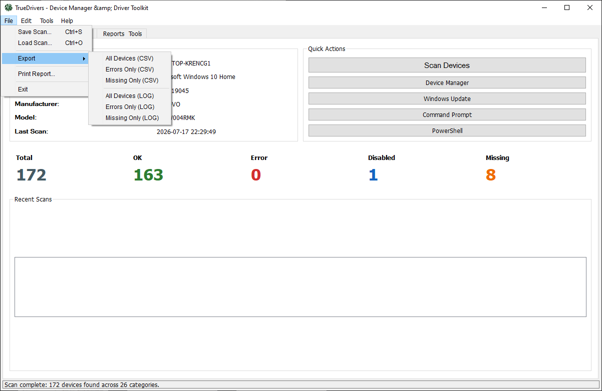
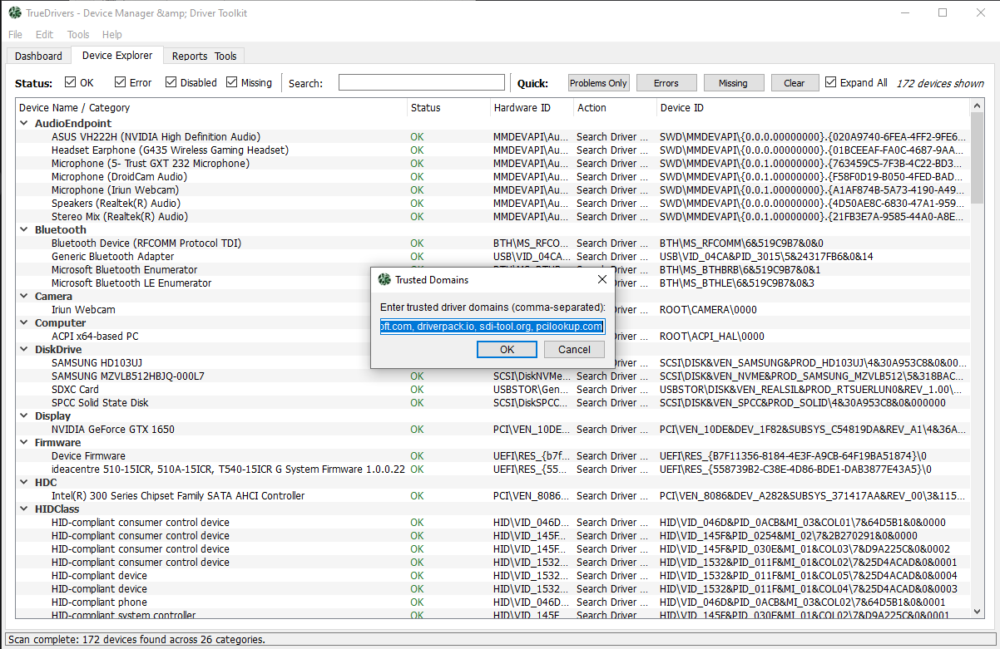
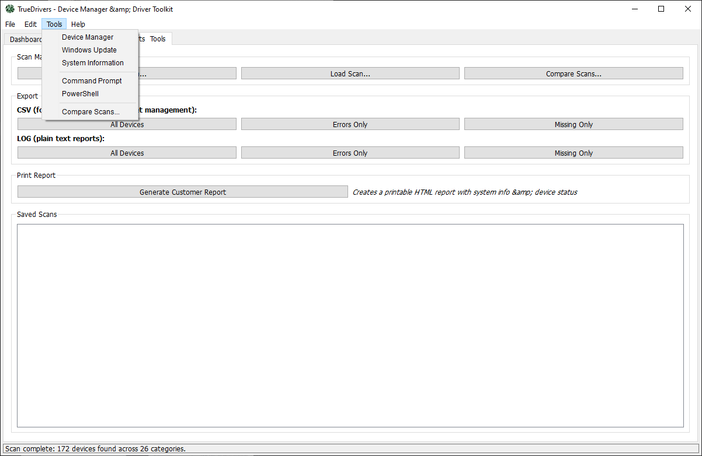
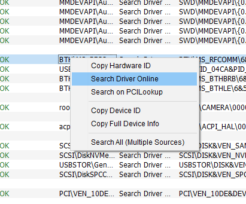
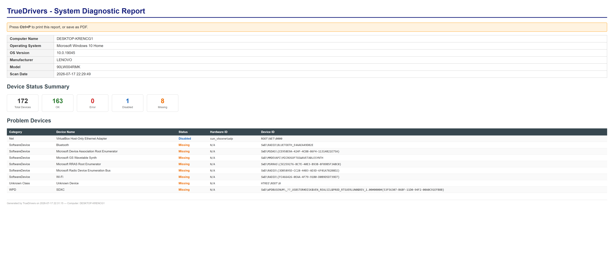

# TrueDrivers

The purpose of this application is to save time and reduce the number of clicks required when managing drivers.

Of course, you can find and install drivers without it, but TrueDrivers helps you locate the correct driver much faster and more efficiently.

I hope this tool saves you time and makes it easier to find the right drivers for your devices.

I have included the `.ui` file because some users may prefer to customize the application's interface. You can modify it however you like using Qt Designer:
https://build-system.fman.io/qt-designer-download

Thank you for trusting and using my application. I hope you find it useful.

## Screenshots

  

  

  

  

  

### Note

I may provide the source code in the future.

I included a landing page here: https://rmrf-dotnet.github.io/TrueDrivers/
